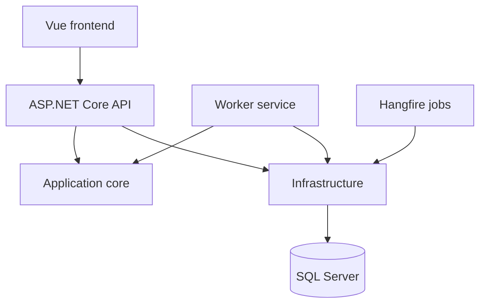

# D&D 5e Spells

A full-stack reference application for importing, storing, searching, and browsing Dungeons & Dragons 5e spells.

The project demonstrates a layered .NET backend, relational modeling with Entity Framework Core, background processing, and a Vue frontend.

## Highlights

- ASP.NET Core Web API on .NET 10
- Layered separation between domain, infrastructure, and hosts
- Entity Framework Core with SQL Server
- Many-to-many spell, class, and subclass relationships
- Paginated, filtered, and sortable spell queries
- Background processing projects with Worker Service and Hangfire
- Vue 3, TypeScript, Pinia, Axios, Vite, and Tailwind CSS frontend

## Architecture



## Repository structure

| Project | Responsibility |
| --- | --- |
| `ApplicationCore` | Domain entities, DTOs, and repository contracts |
| `Infrastructure` | EF Core context, SQL Server persistence, and repositories |
| `WebAPIHost` | HTTP API and composition root |
| `WorkerServiceHost` | Background worker host |
| `HangfireJobs` | Scheduled/background jobs |
| `FrontEnd` | Vue 3 user interface |

## API

| Method | Endpoint | Purpose |
| --- | --- | --- |
| `GET` | `/api/spells` | Paginated spell list with filtering and sorting |
| `GET` | `/api/spells/{id}` | Spell details |
| `POST` | `/api/spells` | Create or update a spell |

List parameters:

- `page`, default `1`
- `pageSize`, default `10`
- `filter`
- `sortBy`, default `name`
- `sortDirection`, default `asc`

## Running the backend

Requirements:

- .NET 10 SDK
- SQL Server
- EF Core command-line tools

```bash
git clone https://github.com/Esphios/DnDSpellsSolution.git
cd DnDSpellsSolution
dotnet restore
dotnet build --configuration Release
```

Configure `ConnectionStrings:DefaultConnection` using user secrets or an environment-specific configuration file. Do not commit production credentials.

```bash
dotnet ef database update --project Infrastructure --startup-project WebAPIHost
dotnet run --project WebAPIHost
```

## Running the frontend

```bash
cd FrontEnd
npm install
npm run dev
```

For a production build:

```bash
npm run build
```

Configure `VITE_API_BASE_URL` to point to the API spell endpoint.

## Data model

The `Spell` aggregate includes its descriptive and casting properties, belongs to one school, and maintains many-to-many relationships with classes and subclasses. Optional damage data models damage type and slot-level scaling.

## Known limitations

- The solution currently targets SQL Server only.
- No automated test project is included in the solution yet.
- A frontend screenshot and hosted demonstration are still pending.
- The create/update operation currently shares one `POST` endpoint.

## License

Distributed under the MIT License. See [`LICENSE`](LICENSE).
